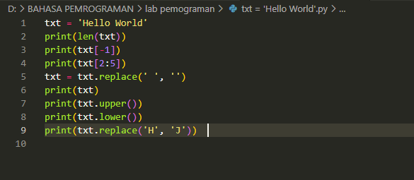
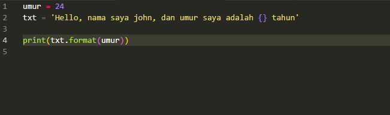

# Latihan string python
txt = 'Hello World'
- Hitung jumlah karakternya
- Ambil karakter terakhir
- Ambil karakter index ke-2 sampai index ke-4 (llo)
- Hilangkan spasi pada text tersebut (HelloWorld)
- Ubah text menjadi huruf besar
- Ubah text menjadi huruf kecil
- Ganti karakter H dengan karakter J 

# PROGRAM 
txt = 'Hello World'

# Hitung jumlah karakternya
print(len(txt))  # Output: 11

# Ambil karakter terakhir
print(txt[-1])  # Output: d

# Ambil karakter index ke-2 sampai index ke-4 (llo)
print(txt[2:5])  # Output: llo

# Hilangkan spasi pada text tersebut (HelloWorld)
txt = txt.replace(' ', '')
print(txt)  # Output: HelloWorld

# Ubah text menjadi huruf besar
print(txt.upper())  # Output: HELLOWORLD

# Ubah text menjadi huruf kecil
print(txt.lower())  # Output: helloworld

# Ganti karakter H dengan karakter J
print(txt.replace('H', 'J'))  # Output: JelloWorld

# Lengkapi kode berikut:

umur = 24
txt = 'Hello, nama saya john, dan umur saya adalah
... tahun'
print(txt.format(umur))
- Untuk menyelesaikan latihan ini, Kita dapat menggunakan method format pada string. Method format akan menggantikan placeholder {} dengan nilai yang diberikan
